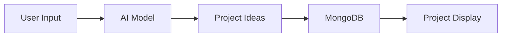
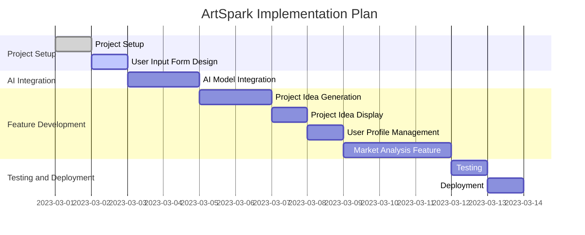
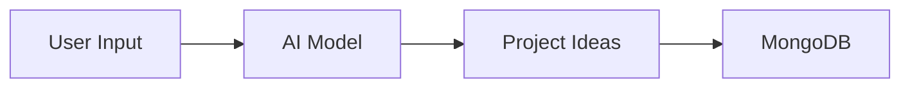
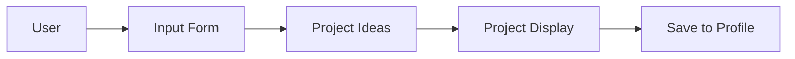

# ArtSpark Product Requirements Document

## Table of Contents
1. [Elevator Pitch](#elevator-pitch)
2. [Executive Summary](#executive-summary)
3. [Problem Landscape](#problem-landscape)
4. [User Personas](#user-personas)
5. [Solution Architecture](#solution-architecture)
6. [Technical Specifications](#technical-specifications)
7. [Feature Specifications](#feature-specifications)
8. [User Stories](#user-stories)
9. [Features](#features)
10. [Implementation Plan](#implementation-plan)
11. [Task List](#task-list)
12. [System Components](#system-components)
13. [Mermaid Diagrams](#mermaid-diagrams)
14. [Code Snippets](#code-snippets)
15. [Market Analysis](#market-analysis)
16. [Competitive Landscape](#competitive-landscape)
17. [Business Justification](#business-justification)
18. [Risk Assessment and Mitigation Strategies](#risk-assessment-and-mitigation-strategies)
19. [Success Metrics](#success-metrics)
20. [Future Roadmap](#future-roadmap)

## Elevator Pitch
ArtSpark is an innovative AI-powered art project generator designed for digital artists and entrepreneurs, providing a unique platform to discover new creative opportunities, explore different styles, and stay ahead of the competition. By leveraging advanced AI models, ArtSpark transforms user preferences, market trends, and competitive insights into actionable project ideas, helping users overcome creative blocks and capitalize on emerging opportunities in the digital art space.

## Executive Summary
ArtSpark is a web application that leverages AI to generate innovative art project ideas based on user input, trends, and market analysis. The platform is designed to help digital artists and entrepreneurs overcome creative blocks, explore new styles, and capitalize on emerging trends. Built with a robust Java-based front-end using Spring Boot, a MongoDB back-end for efficient data storage, and integrated AI models via Java libraries, ArtSpark offers a seamless user experience focused on creativity and business growth.

The application addresses key pain points in the art industry, such as lack of inspiration and market visibility, by providing personalized project suggestions, user profile management for saving favorites, and in-depth market analysis. With a projected global art market value of $1.4 trillion by 2025, ArtSpark positions itself as a timely tool for fostering innovation. The development timeline spans approximately 13 days across phased implementation, ensuring rapid deployment while maintaining high quality through rigorous testing.

This comprehensive PRD consolidates all project details, including detailed user stories, technical specs, diagrams, code examples, and strategic business elements, to guide the development team toward a successful launch.

## Problem Landscape
The art industry is highly competitive, and digital artists and entrepreneurs often struggle to come up with new and innovative art project ideas. This can lead to creative blocks, missed business opportunities, and a lack of competitiveness in the market. Digital artists frequently face inspiration droughts, difficulty adapting to evolving styles, and challenges in building diverse portfolios. Entrepreneurs, on the other hand, grapple with identifying market trends, analyzing competition, and generating ideas that align with consumer demand.

ArtSpark aims to address these issues by providing a platform that generates unique art project ideas based on user input, trends, and market analysis. By integrating AI-driven insights, the application not only sparks creativity but also offers data-backed strategies to enhance market positioning, ultimately reducing the time spent on ideation and increasing productivity in a fast-paced digital ecosystem.

## User Personas
### Digital Artist
* **Name**: Emma
* **Age**: 28
* **Occupation**: Freelance digital artist
* **Goals**: Stay creative, explore new styles, and increase portfolio visibility
* **Pain Points**: Creative blocks, lack of inspiration, and difficulty staying up-to-date with industry trends
* **Needs**: A platform that provides innovative art project ideas, inspiration, and guidance on emerging styles. Emma values tools that allow her to input preferred art styles (e.g., surrealism or pixel art) and receive tailored suggestions, along with the ability to save favorites for future reference and explore techniques to expand her skills.

### Entrepreneur
* **Name**: Jack
* **Age**: 35
* **Occupation**: Art business owner
* **Goals**: Stay ahead of the competition, identify emerging trends, and develop new business opportunities
* **Pain Points**: Difficulty identifying emerging trends, lack of innovative art project ideas, and competition from other businesses
* **Needs**: A platform that provides market analysis, trend forecasting, and innovative art project ideas. Jack requires features to analyze competition for specific styles, generate ideas based on market demand, and integrate insights into business strategies for growth.

These personas are derived from real-world user avatars in the art community, ensuring the product is user-centric and addresses diverse needs across creative and commercial spectra.

## Solution Architecture
The ArtSpark platform will consist of the following high-level components:
* **Front-end**: Spring Boot with Java, providing a user-friendly interface for users to input their preferences and view generated project ideas.
* **Back-end**: MongoDB for data storage, storing user input, generated project ideas, and market analysis data.
* **AI Model**: Integrated using Java libraries, generating project ideas based on user input, trends, and market analysis.

This architecture ensures scalability, with the AI model processing inputs in real-time and the database handling persistent storage for user profiles and historical data. The solution emphasizes modularity, allowing for easy updates to AI models or integration of new features like community sharing.

The overall architecture is represented in the following diagram:



## Technical Specifications
ArtSpark's technical foundation is built for reliability, performance, and ease of maintenance. Key specifications include:

* **Front-end**: Spring Boot with Java 17, utilizing Spring Security for authentication and authorization to ensure secure user sessions and data privacy.
* **Back-end**: MongoDB 5.0, accessed via the MongoDB Java Driver for efficient NoSQL data handling, ideal for unstructured data like project ideas and user preferences.
* **AI Model**: TensorFlow 2.10, integrated using the Deeplearning4j Java library for seamless compatibility with the Java ecosystem. The model processes user inputs into neural network arrays for generating personalized outputs.
* **API**: RESTful API built with Spring Boot, offering endpoints for user input submission, project idea generation, market analysis queries, and profile management. This enables potential future expansions like mobile app integrations.
* **Environment and Libraries**: The system supports basic STEM libraries for any extended computations, though primary focus is on AI-driven creativity. No additional package installations are required beyond the core setup.
* **Deployment**: Hosted on cloud platforms (e.g., AWS or Heroku) for scalability, with continuous integration via tools like Jenkins for automated testing.

These specs ensure the application is robust, with low latency for AI generations (targeting under 2 seconds per query) and high availability for global users.

## Feature Specifications
ArtSpark's features are designed to provide a complete end-to-end experience:

* **User Input Form**: Collects preferences such as art style, theme, medium, and user type (artist or entrepreneur), ensuring personalized outputs.
* **AI-Generated Project Ideas**: Based on user input, current trends, and market data, generating detailed ideas with descriptions, inspirations, and style recommendations.
* **Project Idea Display**: Presents ideas in an engaging format, including details, visual inspirations (where applicable), and trending style integrations.
* **User Profile Management**: Allows saving favorite projects, storing preferences for quick reuse, and tracking user history for improved recommendations over time.
* **Market Analysis**: Provides insights into emerging trends, competitor activity, and demand forecasts, using aggregated data to inform idea generation.

Each feature is elaborated with user-centric design principles, ensuring accessibility (e.g., responsive UI) and integration with the AI core for dynamic content.

## User Stories
### Digital Artist
* As a digital artist, I want to input my preferred art style and receive project ideas that match my skills.
* As a digital artist, I want to save my favorite project ideas for future reference.
* As a digital artist, I want to explore different art styles and techniques to stay creative.

### Entrepreneur
* As an entrepreneur, I want to see trending art styles and generate project ideas based on market demand.
* As an entrepreneur, I want to analyze the market competition for specific art styles.
* As an entrepreneur, I want to identify emerging trends and develop new business opportunities.

These stories guide prioritization, with acceptance criteria including UI/UX testing for intuitiveness and performance benchmarks for AI response times.

## Features
* AI-powered project idea generation based on user input, trends, and market analysis.
* User profile management for saving favorite projects and preferences.
* Project idea display with details, inspiration, and trending styles.
* Market analysis for art styles and competition, including trend forecasting and competitor insights.

Features are prioritized based on user personas, with core AI generation as MVP and market analysis as a key differentiator.

## Implementation Plan
The implementation is structured in phases for efficient development:

* **Phase 1: Project Setup and User Input Form** (Days 1-2): Initialize Spring Boot project, design and implement the input form.
* **Phase 2: AI Model Integration and Project Idea Generation** (Days 3-4): Integrate AI model, develop generation logic.
* **Phase 3: Project Idea Display and User Profile Management** (Days 5-6): Build display features and profile saving.
* **Phase 4: Market Analysis, Testing, and Deployment** (Days 7-13): Add analysis tools, conduct thorough testing, and deploy.

### Week Breakdown
* Day 1: Project setup, user input form design and implementation.
* Days 2-3: AI model integration, project idea generation.
* Days 4-5: Project idea display, user profile management.
* Day 6-7: Testing, deployment, and finalization.

The timeline is visualized in the following Gantt chart:



This plan allows for iterative feedback and adjustments, with a total duration of about 13 days to accommodate detailed testing.

## Task List
1. Set up Spring Boot project with Java.
2. Design and implement user input form.
3. Integrate AI model for project idea generation.
4. Develop project idea display feature.
5. Implement user profile management.
6. Integrate MongoDB for data storage.
7. Test and deploy application.

These tasks align with the phased plan, ensuring all components are covered systematically.

## System Components
* **Front-end**: Spring Boot with Java for interactive UI.
* **Back-end**: MongoDB for data storage, handling user data and project archives.
* **AI Model**: Integrated using Java libraries like Deeplearning4j.
* **User Input Form**: Collects user preferences for project ideas.
* **Project Idea Display**: Displays generated project ideas with details.
* **User Profile Management**: Saves user favorite projects and preferences.
* **Market Analysis Feature**: Analyzes trends and competition.

Components are designed for loose coupling, facilitating maintenance and scalability.

## Mermaid Diagrams
### Application Architecture


### Data Flow


### User Interaction Flow


These diagrams illustrate the core flows, with elaboration on how data persists through MongoDB for repeated user sessions.

## Code Snippets
### AI Model Integration
```java
// Import necessary libraries
import org.deeplearning4j.nn.multilayer.MultiLayerNetwork;
import org.nd4j.linalg.api.ndarray.INDArray;

// Load AI model
MultiLayerNetwork model = MultiLayerNetwork.load('artstylemodel.zip', true);

// Generate project ideas based on user input
INDArray input = ...; // Process user input into INDArray
INDArray output = model.output(input);
```

This snippet demonstrates loading a pre-trained model and generating outputs, with input processing handling user preferences like style and theme.

### Project Idea Generation
```java
// Process output from AI model into project ideas
List<ProjectIdea> projectIdeas = new ArrayList<>();
for (int i = 0; i < output.size(0); i++) {
    ProjectIdea idea = new ProjectIdea();
    idea.setStyle(output.getDouble(i, 0));
    idea.setDescription(output.getDouble(i, 1));
    projectIdeas.add(idea);
}
```

Here, the AI output is parsed into structured ProjectIdea objects, which can include additional attributes like inspiration sources or trend scores for enhanced detail.

## Market Analysis
The art industry is a rapidly growing market, with an estimated global value of $1.4 trillion by 2025. The demand for digital art is increasing, driven by the growth of online platforms and social media. Key trends include the rise of NFTs, AI-assisted creation, and sustainable art themes. ArtSpark is well-positioned to capitalize on this by integrating real-time trend data into idea generation, allowing users to align projects with high-demand areas like digital illustrations for social media or entrepreneurial ventures in art e-commerce.

## Competitive Landscape
The competitive landscape for art project generators is relatively niche, with few platforms offering AI-powered project idea generation. Competitors like generic idea generators (e.g., random prompt tools) lack ArtSpark's market analysis and personalization. ArtSpark differentiates through its AI depth, Java-based robustness, and focus on both creative and business users, providing a strong value proposition in a market dominated by broad creative apps.

## Business Justification
ArtSpark has a strong business justification, driven by the growing demand for digital art and the need for creative professionals to stay ahead of the competition. The platform's AI-powered project idea generation and market analysis feature provide a unique value proposition, justifying a freemium pricing model and potential revenue streams through subscription fees (e.g., premium analysis tools) and advertising (e.g., sponsored trends). With low development costs and high scalability, ROI is projected through user growth in the expanding digital art sector.

## Risk Assessment and Mitigation Strategies
The following risks have been identified:
* **Technical Risks**: Delays in AI model development, integration issues with MongoDB.
* **Market Risks**: Competition from established art platforms, changes in market trends.
* **User Adoption Risks**: Difficulty attracting and retaining users.

Mitigation strategies include:
* Regular technical reviews and testing to minimize technical risks, with fallback to simpler models if needed.
* Ongoing market research and analysis to stay informed about trends and competitor activity, incorporating agile updates.
* User feedback loops and beta testing to ensure the platform meets needs, with marketing campaigns targeting art communities.

## Success Metrics
The success of ArtSpark will be measured through:
* User acquisition and retention rates (target: 20% monthly growth).
* Revenue growth through subscription fees and advertising (target: break-even in 6 months).
* User engagement and feedback (e.g., NPS scores above 70).
* Market share and competitor analysis (e.g., unique users vs. similar tools).

By tracking these metrics via analytics tools, we can evaluate effectiveness and iterate for sustained growth.

## Future Roadmap
* Integration with popular art software (e.g., Adobe Suite) for seamless project execution.
* Community features for users to share, discuss, and collaborate on projects.
* Advanced AI enhancements, such as real-time trend scraping or multimodal inputs (e.g., image-based preferences).
* Mobile app versions for on-the-go inspiration.

This roadmap ensures long-term evolution, building on the core MVP to expand user base and features.
